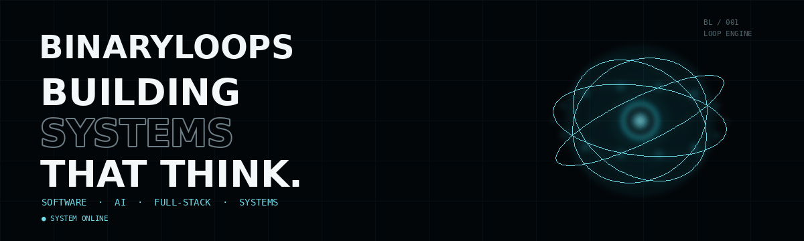
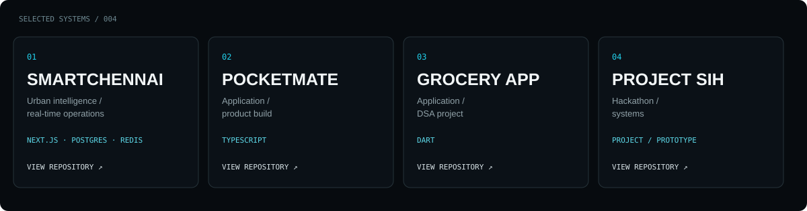

`● SYSTEM ONLINE` &nbsp; **SOFTWARE · AI · FULL-STACK · SYSTEMS**

## 01 / SYSTEMS

> **Building systems that think.**

I build software across intelligent systems, full-stack applications, data, and real-world infrastructure — with a focus on turning ideas into working systems.

### CURRENTLY BUILDING

**[SmartChennai](https://github.com/BinaryLoops/SmartChennai)**  
Intelligent urban infrastructure concept built around real-time telemetry, maps, event processing, multilingual operations, and simulated sensor infrastructure.

`Next.js` `TypeScript` `PostgreSQL` `Prisma` `Redis` `BullMQ` `Socket.IO` `Mapbox`

## 02 / SELECTED SYSTEMS

## 03 / TECHNOLOGY

## 04 / ACTIVITY

<a href="https://github.com/BinaryLoops?tab=repositories">EXPLORE REPOSITORIES ↗</a>
&nbsp;&nbsp; · &nbsp;&nbsp;
<a href="https://github.com/BinaryLoops">VIEW PROFILE ↗</a>

---

## 05 / BUILDER

I like building things at the intersection of **software, data, intelligent systems, and real-world problems**.

**Make the system work — then make it memorable.**

### `BINARYLOOPS / SYSTEM ONLINE`

