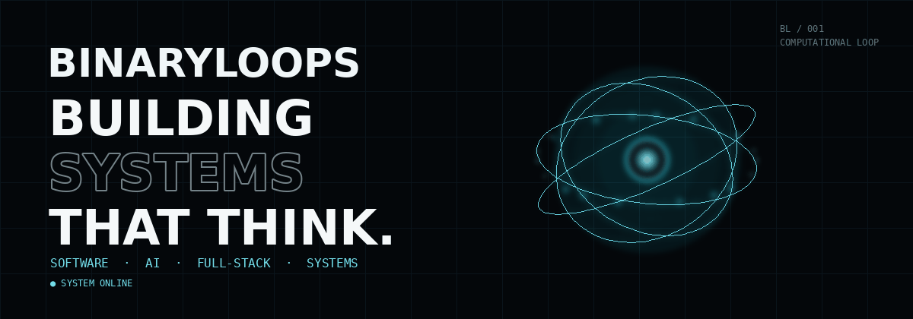

<div align="center">



</div>

<div align="center">

`● SYSTEM ONLINE` &nbsp;&nbsp; `SOFTWARE` · `AI` · `FULL-STACK` · `SYSTEMS`

</div>


## 01 / SYSTEMS

> **Building systems that think.**

I build software across intelligent systems, full-stack applications, data, and real-world infrastructure — with a focus on turning ideas into working systems.

### Currently building

**SmartChennai — Intelligent Urban Infrastructure**

A full-stack command-center concept for city operations, combining real-time telemetry, maps, event processing, role-based operations, multilingual UI, and simulated sensor infrastructure.

**Core stack:** Next.js · TypeScript · PostgreSQL · Prisma · Redis · BullMQ · Socket.IO · Mapbox

---

## 02 / SELECTED SYSTEMS

| System | Focus | Stack |
|---|---|---|
| **[SmartChennai](https://github.com/BinaryLoops/SmartChennai)** | Urban intelligence / real-time operations | Next.js · TypeScript · PostgreSQL · Redis |
| **[PocketMate](https://github.com/BinaryLoops/PocketMate)** | Full-stack application | TypeScript |
| **[GroceryAppDSA](https://github.com/BinaryLoops/GroceryAppDSA)** | Application / DSA | Dart |
| **[projectSIH](https://github.com/BinaryLoops/projectSIH)** | Hackathon / systems | — |

> Repository descriptions above are intentionally concise. The repositories themselves are the source of truth for implementation details.


## 03 / TECHNOLOGY

```text
LANGUAGES       Python · C · C++ · TypeScript · JavaScript · SQL

WEB             React · Next.js · Node.js · Tailwind CSS

APP             Flutter · Dart

DATA            PostgreSQL · MySQL · Prisma · Redis

SYSTEMS         Socket.IO · BullMQ · REST APIs · Real-time systems

CLOUD           AWS · Git · GitHub

3D / VISUAL     Three.js · React Three Fiber · Mapbox
```

## 04 / ACTIVITY

<div align="center">

<a href="https://github.com/BinaryLoops">

</a>

<a href="https://github.com/BinaryLoops">

</a>

</div>


## 05 / BUILDER

I like building things that sit at the intersection of **software, data, intelligent systems, and real-world problems**.

From application development to real-time infrastructure and interactive interfaces, the goal is simple:

**make the system work — then make it memorable.**

---

<div align="center">

### `BINARYLOOPS / SYSTEM ONLINE`

**[VIEW SYSTEMS](https://github.com/BinaryLoops?tab=repositories)** &nbsp; · &nbsp; **[GITHUB](https://github.com/BinaryLoops)**

</div>
