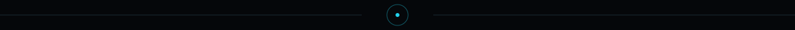
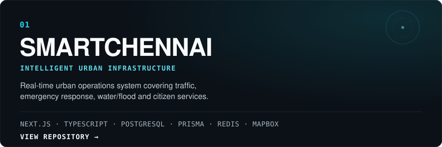
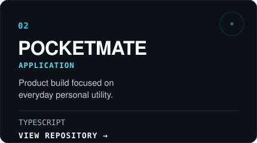
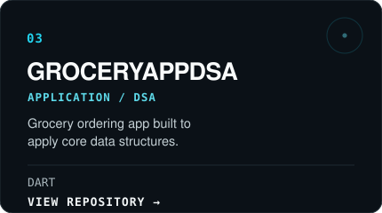
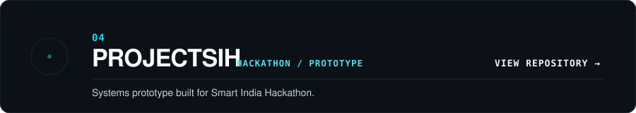

## 01 / SYSTEMS

 

I build software across intelligent systems, full-stack applications, data, and real-world infrastructure — with a focus on turning ideas into working systems.

**Currently building:** [SmartChennai](https://github.com/BinaryLoops/SmartChennai) — an AI-powered urban command system covering traffic, emergency response, water/flood monitoring and citizen services.

## 02 / SELECTED SYSTEMS

<table>
<tr>
<td colspan="2">

</td>
</tr>
<tr>
<td width="50%">

</td>
<td width="50%">

</td>
</tr>
<tr>
<td colspan="2" align="right" width="78%">

</td>
</tr>
</table>

<a href="https://github.com/BinaryLoops/SmartChennai">SmartChennai</a> &nbsp;·&nbsp; <a href="https://github.com/BinaryLoops/PocketMate">PocketMate</a> &nbsp;·&nbsp; <a href="https://github.com/BinaryLoops/GroceryAppDSA">GroceryAppDSA</a> &nbsp;·&nbsp; <a href="https://github.com/BinaryLoops/projectSIH">projectSIH</a>

## 03 / REPOSITORY UNIVERSE

Selected Systems above is a curated highlight reel, not the full picture. This is the wider map — every public repository confirmed as of this writing, plotted as part of one engineering system rather than a flat list of cards.

**Repository index**

| # | Repository | Language |
|---|---|---|
| 01 | [SmartChennai](https://github.com/BinaryLoops/SmartChennai) | TypeScript |
| 02 | [PocketMate](https://github.com/BinaryLoops/PocketMate) | TypeScript |
| 03 | [GroceryAppDSA](https://github.com/BinaryLoops/GroceryAppDSA) | Dart |
| 04 | [projectSIH](https://github.com/BinaryLoops/projectSIH) | — |
| 05 | [Document-AI](https://github.com/BinaryLoops/Document-AI) | Python |
| 06 | [Smart-Hostel](https://github.com/BinaryLoops/Smart-Hostel) | JavaScript |
| 07 | [Fraud_Detector](https://github.com/BinaryLoops/Fraud_Detector) | TypeScript |
| 08 | [network-monitoring-dashboard](https://github.com/BinaryLoops/network-monitoring-dashboard) | TypeScript |
| 09 | [Library-Management-System](https://github.com/BinaryLoops/Library-Management-System) | — |

→ **[VIEW ALL PUBLIC REPOSITORIES](https://github.com/BinaryLoops?tab=repositories)**

Nine public repositories, as listed on GitHub. Private repositories are intentionally not shown. The link above is always the live source of truth.

## 04 / TECHNOLOGY

Languages: Python, C, C++, TypeScript, JavaScript, SQL &nbsp;&#183;&nbsp; Web: React, Next.js, Node.js, Tailwind &nbsp;&#183;&nbsp; App: Flutter, Dart &nbsp;&#183;&nbsp; Data: PostgreSQL, MySQL, Prisma, Redis &nbsp;&#183;&nbsp; Systems: Socket.IO, BullMQ, Mapbox, Git &nbsp;&#183;&nbsp; Cloud: AWS, Docker

## 05 / ACTIVITY

<a href="https://github.com/BinaryLoops?tab=repositories">EXPLORE REPOSITORIES ↗</a>
&nbsp;&nbsp;·&nbsp;&nbsp;
<a href="https://github.com/BinaryLoops">VIEW LIVE CONTRIBUTIONS ↗</a>

## 06 / BUILDER

I build at the intersection of software, data, intelligent systems and real-world problems.

**Make the system work. Then make it memorable.**

`BINARYLOOPS / SYSTEM ONLINE`

<a href="https://github.com/BinaryLoops?tab=repositories">VIEW SYSTEMS</a> &nbsp;·&nbsp; <a href="https://github.com/BinaryLoops">GITHUB</a>

