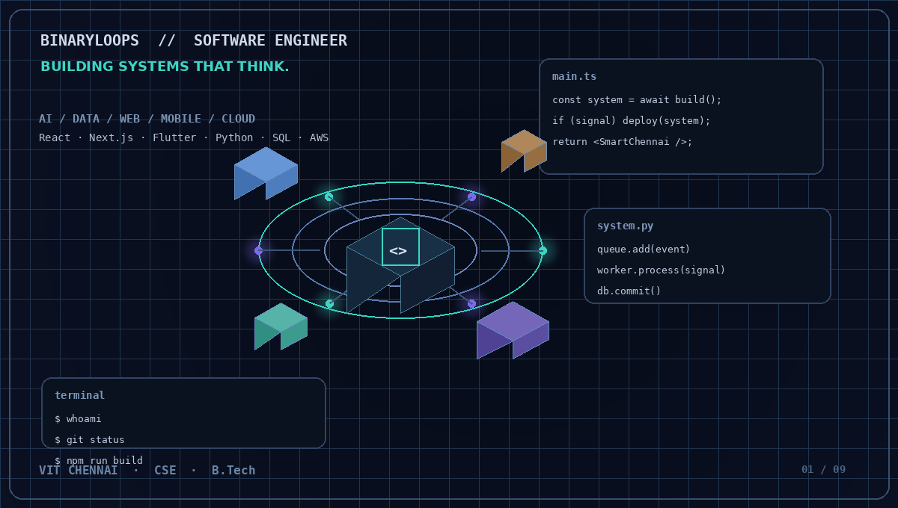
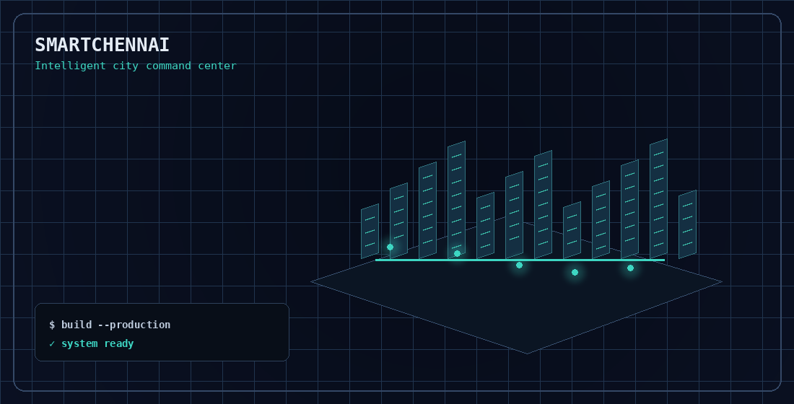
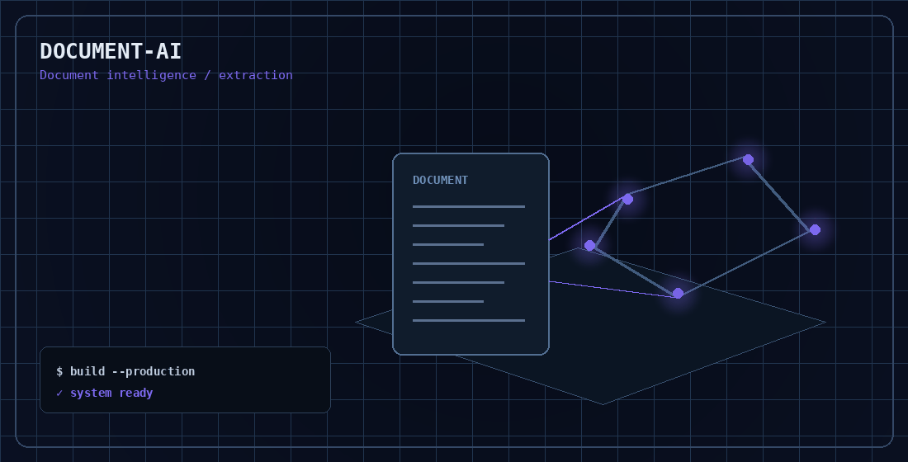
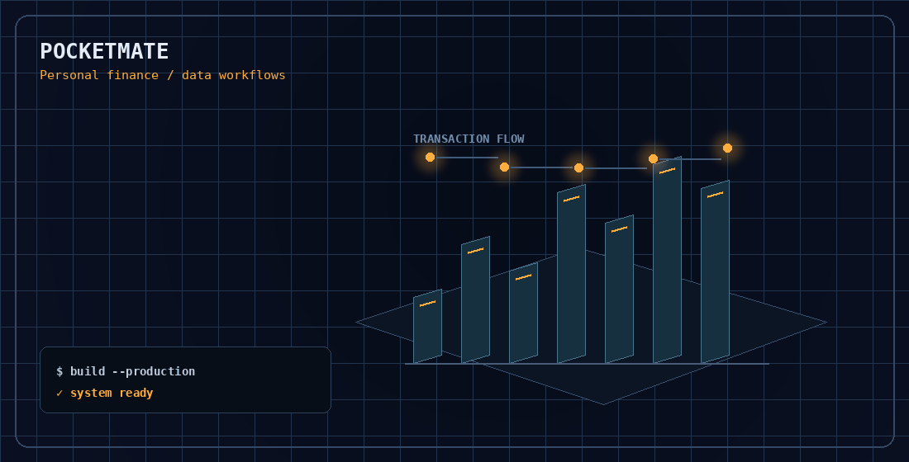
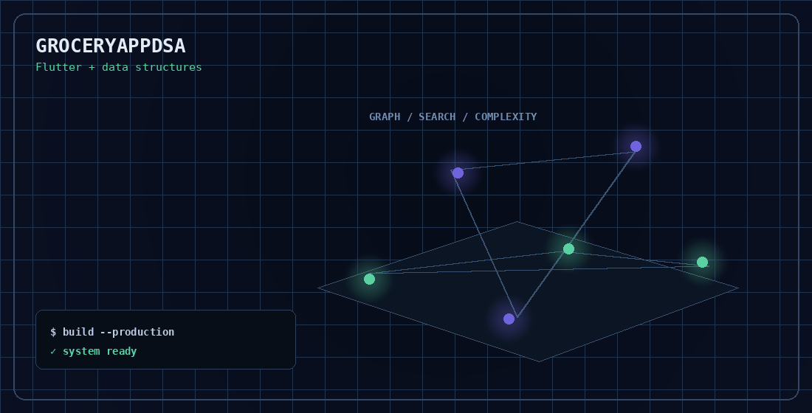
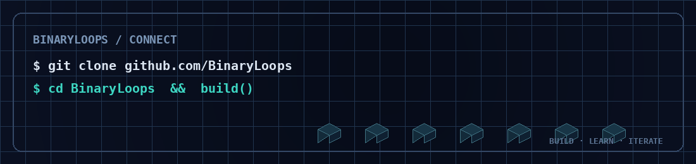

<h1 align="center">AYUSH · BINARYLOOPS</h1>

<strong>Software Engineer · AI Builder · Full-Stack Developer</strong> Building practical systems across AI, data, web, mobile, backend and real-world infrastructure.

<a href="https://github.com/BinaryLoops">GitHub</a> ·
<a href="https://github.com/BinaryLoops?tab=repositories">Repositories</a> ·
<a href="https://github.com/BinaryLoops/SmartChennai">SmartChennai</a>

---

## 👨‍💻 About me

I'm a **B.Tech Computer Science Engineering student at VIT Chennai** who likes taking an idea from **concept → prototype → working system → better architecture**.

My work sits at the intersection of **software engineering, AI, data, application development and real-world systems**. I enjoy building interfaces that are useful, backends that are structured, and projects that solve an actual problem rather than stopping at a demo.

### ⚙️ What I work with

| Area | Focus |
| --- | --- |
| 🤖 **AI / Intelligent Systems** | Document intelligence, AI-assisted applications, computer vision, automation |
| 🌐 **Full-Stack** | React, Next.js, TypeScript, APIs, databases, responsive interfaces |
| 📱 **Mobile** | Flutter, Dart, Android application workflows |
| 🗄️ **Backend / Data** | Python, SQL, MySQL, PostgreSQL, Prisma, DBMS, PL/SQL |
| ☁️ **Systems / Cloud** | AWS, Redis, BullMQ, Socket.io, real-time architecture |
| 🧠 **Core CS** | DSA, algorithms, DBMS, system design, problem solving |

---

## 🚀 Currently building

### SmartChennai — Intelligent City Command Center

A full-stack **Smart Chennai ICCC** platform designed as a digital command layer for urban operations.

**Stack:** `Next.js` · `TypeScript` · `PostgreSQL` · `Prisma` · `Redis` · `BullMQ` · `Socket.io` · `Mapbox`

The system brings together simulated city telemetry, traffic, water, incidents, emergency response, operator dashboards, multilingual interfaces and real-time events into one platform.

→ **[View SmartChennai](https://github.com/BinaryLoops/SmartChennai)**

---

## 🧩 Selected systems

### Document-AI

Document intelligence focused on extracting useful structure from unstructured documents.

→ **[Repository](https://github.com/BinaryLoops/Document-AI)**

### PocketMate

A personal finance application built around relational data and transaction workflows.

→ **[Repository](https://github.com/BinaryLoops/PocketMate)**

### GroceryAppDSA

A Flutter application bringing data structures and algorithms into a practical application workflow.

→ **[Repository](https://github.com/BinaryLoops/GroceryAppDSA)**

---

## 📦 All repositories

Every repository currently represented in this profile is listed below — including smaller systems and the profile repository itself.

| Repository | Area | Description |
| --- | --- | --- |
| **[SmartChennai](https://github.com/BinaryLoops/SmartChennai)** | `TypeScript` · Web | Smart Chennai ICCC — integrated urban command dashboard |
| **[Document-AI](https://github.com/BinaryLoops/Document-AI)** | `Python` · AI | DocuMind AI — document intelligence, SIH PS23 |
| **[PocketMate](https://github.com/BinaryLoops/PocketMate)** | `TypeScript` · Data | Personal finance tracker built on a relational DBMS core |
| **[GroceryAppDSA](https://github.com/BinaryLoops/GroceryAppDSA)** | `Dart` · Mobile | Flutter grocery app exercising core data structures |
| **[Fraud_Detector](https://github.com/BinaryLoops/Fraud_Detector)** | `TypeScript` · AI | FraudGuard — transaction anomaly screening |
| **[network-monitoring-dashboard](https://github.com/BinaryLoops/network-monitoring-dashboard)** | `TypeScript` · Systems | Live network health and traffic monitoring |
| **[Library-Management-System](https://github.com/BinaryLoops/Library-Management-System)** | `Python` · Data | Catalogue, lending and member records |
| **[Smart-Hostel](https://github.com/BinaryLoops/Smart-Hostel)** | `JavaScript` · Web | Hostel operations and room allocation |
| **[projectSIH](https://github.com/BinaryLoops/projectSIH)** | `AI` | Reserved project namespace |
| **[BinaryLoops](https://github.com/BinaryLoops/BinaryLoops)** | `Profile` | This GitHub profile README and its assets |

→ **[Open the complete GitHub repository list](https://github.com/BinaryLoops?tab=repositories)**

---

## 🛠️ Technology stack

**Languages**

`C` `C++` `Java` `Python` `JavaScript` `TypeScript` `Dart` `SQL`

**Frontend / Mobile**

`React` `Next.js` `Flutter` `Android` `Tailwind CSS`

**Backend / Data**

`Node.js` `MySQL` `PostgreSQL` `Prisma` `Redis` `BullMQ` `Socket.io` `PL/SQL`

**Cloud / Tools**

`AWS` `Git` `GitHub` `Mapbox`

---

## 📚 Currently learning

**Data Structures & Algorithms** · **Database Systems** · **Cloud Architecture** · **Backend Engineering** · **AI Systems** · **Real-Time Applications**

I like learning by building: understand the concept, implement it, test it, then improve the architecture.

---

## 🎨 Beyond code

**Visual design · poster creation · pencil art · music · digital experiences**

I enjoy combining engineering with visual design — especially when a technical project can feel as intentional as a product.

---

